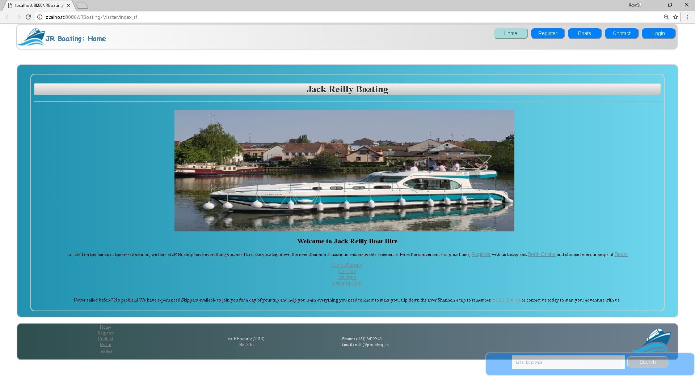

## Team Project

### Team Members

| Name: | Student No: |
| --- | --- |
| [Joe O'Regan](https://github.com/joeaoregan) | A00258304 |
| **Elaine Santos G Ottero** | A00248619 |
| [Ademola Alade](https://github.com/demrott) | A00212817 |
| [Kiev Reynolds](https://github.com/kievr) | A00258306 |
| **Sorcha Bruton** | A00258344 |

### JR Boating

- Assignment Specification: [JR Boating](assignment.md)
- [Functional Requirements](functional-requirements.md)
- [User Stories](user-stories/index.md)
    - [Manager](user-stories/manager.md)
    - [Customer](user-stories/customer.md)
    - [Front Desk](user-stories/front-desk.md)
    - [Skipper](user-stories/skipper.md)
- [Users](users.md)
- [Definition of Done](definition-of-done.md)
- [Sprint 1](sprint1.md)
- [Sprint 2](sprint2.md)
- [Software Testing](software-testing.md)
    - [Test Run 1](test-run-1.md)
    - [Test Run 2](test-run-2.md)
    - [Test Run 3](test-run-3.md)
    - [Test Run 4](test-run-4.md)
- [Screenshots](screenshots.md)
