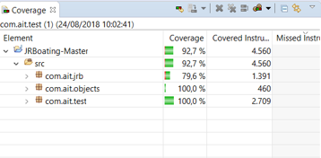

## Code Coverage

    Figure 1. Code Coverage Summary

    Figure 2. Code Coverage Detailed

## Manual Tests Results

Manual Test Results are reported for each Test run.

Result for Test Run - 001

    Summary of Test Results for Test Run 001

| Total Number of Tests | Number of Tests executed in this test run | Date and Time of Test run | Number of Passed Tests in Test Run | Number of Failed Tests in Test run | Number of new Bug reports in Test run | Number of Bug reports verified and closed in Test run |
| --------------------- | ----------------------------------------- | ------------------------- | ---------------------------------- | ---------------------------------- | ------------------------------------- | ----------------------------------------------------- |
| 55                    | 16                                        | 21/08/2018 17:00          | 1                                  | 15                                 | 8                                     | 0                                                     |
| 55                    | 45                                        | 22/08/2018 14:00          | 24                                 | 21                                 | 16                                    | 5                                                     |
| 55                    | 55                                        | 23/08/2018 09:50          | 45                                 | 10                                 | 1                                     | 8                                                     |
| 55                    | 55                                        | 23/08/2018 16:00          | 48                                 | 7                                  | 0                                     | 7                                                     |

## Detailed Test Results

1. [Test Run 1](test-run-1.md)
1. [Test Run 2](test-run-2.md)
1. [Test Run 3](test-run-3.md)
1. [Test Run 4](test-run-4.md)
