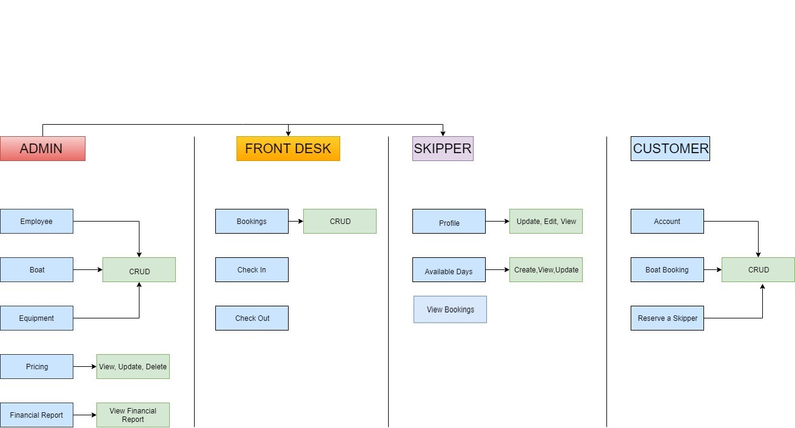
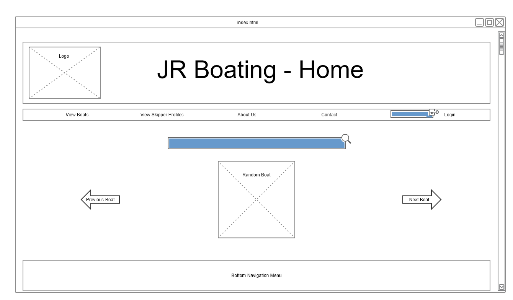
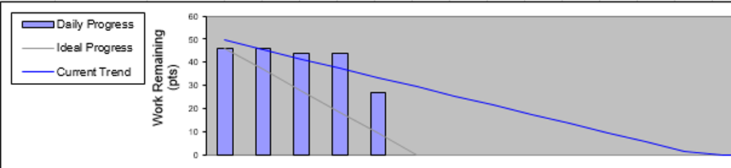
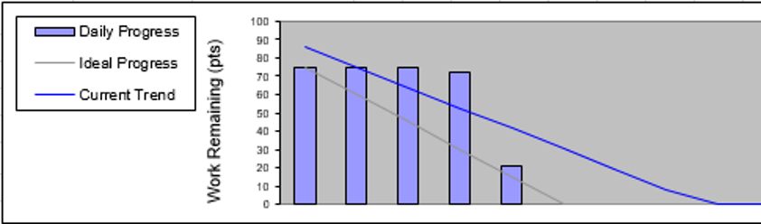
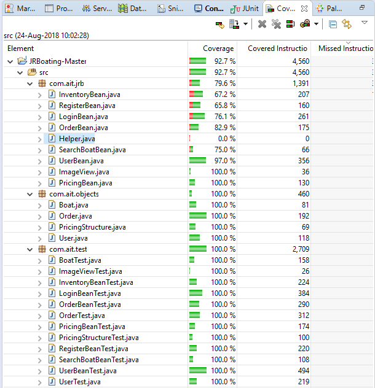

# Certificate in Software Engineering
## Team Project Labs

![AIT](https://img.shields.io/badge/-2018-white?style=flat&logo=data:image/svg+xml;base64,PHN2ZyB2ZXJzaW9uPSIxLjEiIGlkPSJsYXllciIgdmlld0JveD0iLTE1MyAtNDYgNjA1LjI0NjM0IDQxNC44Mzc1OSIgeG1sbnM9Imh0dHA6Ly93d3cudzMub3JnLzIwMDAvc3ZnIj4NCjxzdHlsZT4uc3Qwe2ZpbGw6IzQ2NDY0NTt9LnN0MXtmaWxsOiNFNTJDNjQ7fS5zdDJ7ZmlsbDojMDBCNkVEO30uc3Qze2ZpbGw6I0ZERDMxNDt9PC9zdHlsZT4NCjxnIHRyYW5zZm9ybT0idHJhbnNsYXRlKC0xLjE1MTA2MDYsLTQ2Ljk0MzI3NCkiPg0KPHBhdGggY2xhc3M9InN0MCIgZD0ibSA0NTMuMTM2MSw1Mi45Nzk2MTIgYyAyLjIsMTYuMiAtMTAuMSw0MS4xIC0xNC4xLDU1LjE5OTk5OCAtMC41LDMuMyA0LjQsMS4xIDQuNywzLjUgLTMuNCwxNi45IC0xOS4yLDIxLjYgLTIzLjUsMzcuNiAwLjQsNC4zIDUsNC40IDUuOSw4LjIgLTEuOSw2LjQgLTYuNCwxMC4xIC04LjIsMTYuNCAtMTYuOSw1LjEgLTIyLjcsMjEuMiAtNDQuNywyMS4yIDIuMSwzNC45IDEuNiw3OC42IC0zLjUsMTA5LjEgMS4xLDIyLjYgLTYsNjAuMiAtOS40LDgyLjIgMS42LDkuOCAtMy41LDE2LjIgLTUuOSwxNi41IC02LjksLTAuOCAtNy4yLC03LjQgLTEzLjMsLTEzLjMgLTUuMSw5LjQgLTEyLjgsMTYuNyAtMjkuMSw4LjYgLTcuMSwtMy41IC0xMC40LC0xOS4zIC0xMS43LC0yOC4yIC03LjcsLTUwLjkgNy42LC0xMzMuOSA1LjksLTE3Ny4yIC0xMS45LC04LjMgLTI3LjksLTguNiAtNDAsLTE2LjQgLTEyLjYsLTguMiAtMjguMiwtMjMuMSAtMzIuOSwtMzkuOSAwLjIsLTQuNSA2LjUsLTIuOSA4LjIsLTUuOSAxLjUsLTQuNyAtMy45LC0yLjQgLTIuNCwtNy4xIDI2LjMsLTE1LjkgNjMuNSwtNyAxMDIuMywtOS40IDQ2LjgsLTIuOSA4OSwtMzYuMDk5OTk4IDExMS43LC02MS4wOTk5OTgiLz4NCjxwYXRoIGNsYXNzPSJzdDAiIGQ9Im0gMjA2LjMzNjEsMTc2LjI3OTYxIGMgMi41LDI1LjQgMTAuMSw1OC45IDkuNCw4Ni45IC0wLjIsNi40IC0wLjksMTcgLTIuNCwyMi4zIC0yLjQsOC42IC05LjQsMTEuNyAtMTEuOCwxNy42IC0yLjUsNiAtMC4yLDEzLjQgLTIuNCwyMi4zIC0wLjksMy42IC00LjksNi41IC01LjksMTAuNiAtMi4yLDguOSA2LjEsMTguOSAwLDI1LjggNC40LDEyLjIgNy4xLDE3LjYgNy4xLDMyLjkgLTYuOSwtMi41IC0xMC4yLC04LjYgLTE4LjgsLTkuNCAtNDguNiwtNjEuOCAtNTMuOSwtMTcwLjkgLTMyLjksLTI2MS44IDEyLjMsLTEwLjkgNDIsLTcuNCA0OS40LDMuNSA3LjgsMTEuNSA2LjUsMzIuNSA4LjMsNDkuMyIvPg0KPHBhdGggY2xhc3M9InN0MCIgZD0ibSAxMS4xMzYwOTksMjI1LjU3OTYxIGMgLTUuMTAwMDAwMSwtMTMuNyAtOS4yMDAwMDAxLC0yOC40IC0xNi41MDAwMDAxLC0zOS45IC01LjQ5OTk5OTksMTQuOSAtMTQuNDk5OTk5OSwyNi4xIC0xOC43OTk5OTk5LDQyLjIgMTIuOCwxLjcgMjQuNzk5OTk5ODUsLTAuMiAzNS4zLC0yLjMgbSA4MS4xLDcwLjQgYyA5LjMwMDAwMSwyOS4zIDUwLjAwMDAwMSw1My4zIDMyLjkwMDAwMSw4Ni45IC0zNS4zMDAwMDEsOS4zIC00NS42MDAwMDEsLTUgLTU4LjgwMDAwMSwtMzAuNSAtNy40LC0xNC4xIC0xMS40LC0zMC41IC0yMCwtMzguNyAtMzMuMyw0LjEgLTc0LDQuMiAtMTAxLjEsLTkuNCAtMTYuMiwzMy42IC0zMC45LDY4LjYgLTQ1Ljg5OTk5OSwxMDMuMyAtNy4zLDIuNCAtMTEuNSw4LjMgLTE4LjgsOC4yIC0xMC45LDAgLTI4LjcsLTE1LjggLTMxLjgsLTI1LjggLTEuNCwtNC42IDAsLTIxLjMgMS4yLC0yNyAzLjksLTE5IDIxLC00MiAzMS43LC02Mi4yIDIwLjA5OTk5OSwtMzcuOCA0My43OTk5OTksLTgzLjkgNjMuNDk5OTk5LC0xMjMuMiAxMy4yLC0yNi40IDI1LjEsLTUxLjMgNDIuMywtNjkuMyAxMi44OTk5OTk4NSwtMi43IDcuMzk5OTk5OSwxMyAyMS4wOTk5OTk5LDkuNCAxOC4wMDAwMDAxLDIwIDM5LjAwMDAwMDEsNTUuMSA1MC41MDAwMDAxLDg5LjIgMiw1LjggMS4xLDEyLjggNC43LDE3LjYgMi42LDMuNSA4LjYsMy42IDE0LjEsOC4yIDIuNywyLjMgMy42LDcuNyA1LjksOS40IDQuMywzLjIgMTAuNSwyLjIgMTQuMSw1LjkgMy43MDAwMDEsMy45IDcuNzAwMDAxLDE0LjQgNy4wMDAwMDEsMjEuMSAtMC43LDYuNSAtNi45MDAwMDEsOC4yIC05LjQwMDAwMSwxNC4xIC0yLDUuNSAzLjIsMTAuMyAtMy4yLDEyLjgiLz4NCjxwYXRoIGNsYXNzPSJzdDEiIGQ9Im0gLTI4LjI2MzkwMSwxNy44Nzk2MTIgYyAwLDAgNDMuNCwtMjkuNiA0OS4zLDAgMCwwIDE5LjcsMTUuOCAwLDI3LjYgMCwwIC0zMy41LDI3LjYgLTQxLjQsMCAwLDAgNS45LC0xMi43IC03LjksLTE0LjIgMCwtMC4xIC00LDIuMyAwLC0xMy40Ii8+DQo8cGF0aCBjbGFzcz0ic3QyIiBkPSJtIDE3Mi43MzYxLDY4LjA3OTYxMiBjIDAsMCAtMzcuNSwtMzYuOCAtOS42LC00OC4zIDAsMCAxMS42LC0yMi40MDAwMDAzIDI3LC01LjQgMCwwIDMzLjYsMjcuNSA4LjEsNDAuNiAwLDAgLTEzLjYsLTMuMyAtMTIuNCwxMC41IDAsMCAzLjIsMy40IC0xMy4xLDIuNiIvPg0KPHBhdGggY2xhc3M9InN0MyIgZD0ibSAzNzEuNTM2MSwzLjI3OTYxMTcgYyAwLDAgMjcuMSw0NC45MDAwMDAzIC0yLjgsNDkuMjAwMDAwMyAwLDAgLTE2LjgsMTguOCAtMjcuNiwtMS42IDAsMCAtMjUuNiwtMzUgMi4zLC00MS4zMDAwMDAzIDAsMCAxMi4zLDYuNjAwMDAwMyAxNC43LC03LjEgMC4xLDAuMSAtMi4xLC00IDEzLjQsMC44Ii8+DQo8L2c+DQo8L3N2Zz4=)

**Student Name**: Joe O'Regan  
**Student Number**: A00258304  
**Course**: Certificate in Software Engineering (Level 8), 2018  
**Module**: Team Project

---

## CA

### Team Members
| Name: | Student No: | Name: | Student No: |
| --- | --- | --- | --- |
| [Joe O'Regan](https://github.com/joeaoregan) | A00258304 |  [Kiev Reynolds](https://github.com/kievr) | A00258306 |
| **Elaine Santos G Ottero** | A00248619 |  **Sorcha Bruton** | A00258344 |
| [Ademola Alade](https://github.com/demrott) | A00212817 |

---

### CA Documentation

- [CA Overview](https://joeaoregan.github.io/AIT-CSE-TeamProject/ca/)
- [Assignment Specification](https://joeaoregan.github.io/AIT-CSE-TeamProject/ca/assignment/)
- [Functional Requirements](https://joeaoregan.github.io/AIT-CSE-TeamProject/ca/functional-requirements/)
- [User Stories](https://joeaoregan.github.io/AIT-CSE-TeamProject/ca/user-stories/)
    - [Manager](https://joeaoregan.github.io/AIT-CSE-TeamProject/ca/user-stories/manager/)
    - [Customer](https://joeaoregan.github.io/AIT-CSE-TeamProject/ca/user-stories/customer/)
    - [Front Desk](https://joeaoregan.github.io/AIT-CSE-TeamProject/ca/user-stories/front-desk/)
    - [Skipper](https://joeaoregan.github.io/AIT-CSE-TeamProject/ca/user-stories/skipper/)
- [Users](https://joeaoregan.github.io/AIT-CSE-TeamProject/ca/users/)
- [Definition of Done](https://joeaoregan.github.io/AIT-CSE-TeamProject/ca/definition-of-done/)
- [Sprint 1](https://joeaoregan.github.io/AIT-CSE-TeamProject/ca/sprint1/)
- [Sprint 2](https://joeaoregan.github.io/AIT-CSE-TeamProject/ca/sprint2/)
- [Software Testing](https://joeaoregan.github.io/AIT-CSE-TeamProject/ca/software-testing/)
    - [Test Run 1](https://joeaoregan.github.io/AIT-CSE-TeamProject/ca/software-testing/test-run-1/)
    - [Test Run 2](https://joeaoregan.github.io/AIT-CSE-TeamProject/ca/software-testing/test-run-2/)
    - [Test Run 3](https://joeaoregan.github.io/AIT-CSE-TeamProject/ca/software-testing/test-run-3/)
    - [Test Run 4](https://joeaoregan.github.io/AIT-CSE-TeamProject/ca/software-testing/test-run-4/)
- [Screenshots](https://joeaoregan.github.io/AIT-CSE-TeamProject/ca/screenshots/)

Screenshots 

<i>Click here for larger images, or individual thumbnails to go to raw images.</i>

    JR Boating: Home

    Register

    Boat Details

    Login

    Manager Home

    Manage users

    Manage inventory

    Requirements

    Wireframe

Definition of Done

### Definition of Done
* For a user story to be declared done unit testing must be fully developed and pass all unit tests. 
* Unit testing code coverage must be at least 85%.
* All acceptance criteria must be tested and passed. 
* All documentation relating to the user story must be completed, including the unit test template, the user guide and the bug list (if applicable).

Sprint 1 

<i>Click to Expand</i>

### Sprint 1:

|  | User Story | Planned | In Progress | Done
| --- | --- |---| ---| ---|
| 1 | **Manager: Login** | Code, Unit Test, User Guide, System Test | **Elaine**: Code & unit test and user guide, **Sorcha**: System tests | - |
| 2 | **Manager: Add boat** | Code, Unit Test, User Guide, System Test | **Ade**: Code & unit test, **Sorcha**: System tests | - |
| 3 | **Manager: View inventory** | Code, Unit Test, User Guide, System Test | **Sorcha**: code & unit test, system tests | - |
| 4 | **Manager: Add pricing structure** | Code, Unit Test, User Guide, System Test | - | **Joe**: code,test |
| 5 | **Manager: View pricing structure** | Code, Unit Test, User Guide, System Test | - | **Joe**: code,test |
| 6 | **Customer: Search site** | Code, Unit Test, User Guide, System Test | - | **Joe**: code |
| 7 | **Customer: Register** | Code, Unit Test, User Guide, System Test | - | **Joe**: Code |
| 8 | **Customer: Login** | Code, Unit Test, User Guide, System Test | - | **Joe**: Code |
| 9 | **Customer: Book boat** | Code, Unit Test, User Guide, System Test | - | **Joe**: Code |
| 10 | **Customer: Pay boat deposit** | Code, Unit Test, User Guide, System Test | - | - |

    Sprint 1: Burn Down Chart

Sprint 2 

<i>Click to Expand</i>

### Sprint 2:

#### Sprint 2: Goal
* A registered customer will be able to search the site, reserve a boat, edit boat bookings and pay a deposit.
* The manager will be able to create employee accounts and facilitate adding account details, boat prices and the pricing structure.
* The site will be intuitive to navigate and have a pleasant appearance.
* The front desk staff and skipper will be able to login and out of the site.

    Sprint 2: Burn Down Chart 

Software Testing and Code Coverage 

<i>Click here for Software Testing and Code Coverage Section</i>

### Code Coverage

    Code Coverage Summary

    Code Coverage Detailed

### Wireframe

## Labs

1. **Labs** HTML, CSS
    - [Exercise 1 Basic HTML Page (Bait Shop)](https://joeaoregan.github.io/AIT-CSE-TeamProject/labs/exercise-1/)
    - [Exercise 2.1 CSS](https://joeaoregan.github.io/AIT-CSE-TeamProject/labs/exercise-2/1/)
    - [Exercise 2.2 CSS – Box Model](https://joeaoregan.github.io/AIT-CSE-TeamProject/labs/exercise-2/2/)
    - [Exercise 2.3 CSS – Box Model – Floating elements](https://joeaoregan.github.io/AIT-CSE-TeamProject/labs/exercise-2/3/)
    - [Exercise 2.4 (Halloween Store)](https://joeaoregan.github.io/AIT-CSE-TeamProject/labs/exercise-2/4/)
2. **JSF App**
3. **JSF Table**
4. [JSF Tags](https://joeaoregan.github.io/AIT-CSE-TeamProject/jsf/tags/)
5. [PrimeFaces](https://joeaoregan.github.io/AIT-CSE-TeamProject/primefaces/)
    - [xhtml](Primefaces/WebContent)
    - [Beans](Primefaces/src/com/ait/jsf)

---

## Screenshots

### Lab 2 Bait Shop and Halloween Store

Click here for larger images, or individual thumbnails to go to raw images.

    Lab 2 Exercise 2: Bait Shop

---

    Lab 2 Exercise 3: Bait Shop

---

    Lab 2 Exercise 4: The Halloween Store

### JSF Tags

Click here for larger images, or individual thumbnails to go to raw images.

    JSF Tags

---

    JSF Tags: Home

---

    JSF Tags: Shopping Cart

---

    JSF Tags: Confirmation Page

---

    JSF Tags: Bulk Confirmation Page

---

    JSF Tags: Additional Information Page

