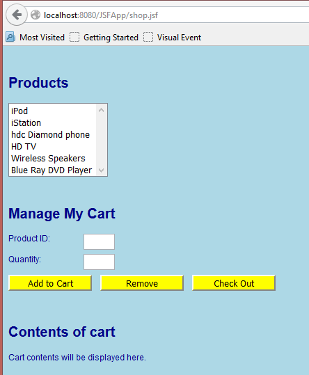

## 3 Defining JSF Managed Beans

### Overview

In this lab you will extend the functionality of the "Shopping" Web application you created in the previous lab. Here's a quick reminder of how the shop.xhtml page appears at the moment:



You will define two managed beans for the Web application:

- CartBean – A session-scope bean that holds the customer's shopping cart.
- ShopBean – A request-scope backing bean for the shop.xhtml page.
You will also modify the shop.xhtml page to bind various controls and events to these beans.

### Roadmap

There are four exercises in this lab:

1.	[Define the CartBean session-scope bean](#step-1-define-the-cartbean-session-scope-bean).
2.	[Define the ShopBean request-scope bean](#step-2-define-the-shopbean-request-scope-bean).
3.	[Bind UI controls and events to the managed beans](#step-3-bind-ui-controls-and-events-to-the-managed-beans).
4.	[Display the contents of the shopping cart](#step-4-display-the-contents-of-the-shopping-cart).

---

### Step 1:  Define the CartBean session-scope bean

In this exercise you will define a session-scope managed bean named `CartBean`. This bean will have an ArrayList of all the items in the customer's shopping cart. 
The first step is to define an `Item` class, to represent one item in the shopping cart:

- In the package com.ait.jsf, create a new Java class named `Item`.
- Paste-in the contents of the prewritten Item class. 
- Review the source code in the Item class. The class contains the product ID and quantity for an item in the shopping cart. There are getters and setters for these fields, plus a couple of constructors. There is also an `equals()` method that deems two Item objects to be "equal" if they have the same product ID.

Create a new Java class named `CartBean` and annotate it with `@ManagedBean` and `@SessionScoped`. The default bean name will be `cartBean` (note the lower-case c).

Implement the CartBean class as follows:

- Define and instantiate an `ArrayList<Item>` instance variable named `items`, and define a getter/setter.
- Define a public method named `addItemToCart()`. The method should take two int parameters – `productID` and `quantity`. The method should create a new Item from these values, and call `items.add()` to add it to the list.
- Define a public method named `removeItemFromCart()`. The method should take a single int parameter – `productID`. The method should create a new Item from this value, and call `items.remove()` to remove it from the list. (The ArrayList will remove the first Item that it finds with the same product ID, based on the implementation of the `equals()` method in the Item class). 
- Define a public method named `getItemCount()`. The method should return an int, indicating the number of items in the ArrayList (use `items.size()` to get this info).

---

### Step 2:  Define the ShopBean request-scope bean

Define a request-scope managed bean named ShopBean, to act as the backing bean for the `Shop.xhtml` page. 

Add the following members to the bean, to hold data for the page and to handle its events:

- `productID` and `quantity` instance variables (both ints) – Hold the product ID and quantity values entered by the user on the page.
    ```java
    private int productID;
    private int quantity;
    ```
- Getters and setters for `productID` and `quantity`.
- `addHandler()` method – Handles the "Add to Cart" button click event, to add an item to the user's shopping cart. To do this, you'll first need to get access to the CartBean bean, and then invoke its `addItemToCart()` method 

    ```java title="addHandler()""
    public String addHandler() {
        CartBean cart = Helper.getBean("cartBean", CartBean.class);
        cart.addItemToCart(productID, quantity);
        return null;
    }
    ```
 
    A Helper class (`Helper.java`) is provided. Add this class to your project, and call the `getBean()` method to get the "cartBean" bean as follows:

    ```java
    CartBean cart = Helper.getBean("cartBean", CartBean.class);
    ```

- `removeHandler()` method – Handles the "Remove" button click event, to remove an item from the user's shopping cart. To do this, invoke the `removeItemFromCart()` method on the "cartBean" bean. 

    ```java title="removeHandler()"
    public String removeHandler() {
        CartBean cart = Helper.getBean("cartBean", CartBean.class);
        cart.removeItemFromCart(productID);
        return null;
    }
    ```

---

### Step 3:  Bind UI controls and events to the managed beans 

In the web folder, open `Shop.xhtml` and remind yourself about the various JSF tags on the page. Then bind the following JSF tags to properties in the shopBean bean (i.e. the backing bean for this page):

- **productsListBox** - 	Set its value to the `shopBean.productID` property.  
    This will cause the value of the currently selected item to be copied into the `productID` property in the backing bean.

    Also set `onchange="this.form.submit();`"  
    As soon as the user clicks an item in the list, the JavaScript onchange event will cause an immediate post-back to the server (so the `productID` property will be updated immediately to indicate the selected item).

    ```xhtml
    <h:selectOneListbox id="productsListBox"
    value="#{shopBean.productID}"
    onchange="this.form.submit();"
    title="Products you can buy online">
    <f:selectItem itemLabel="iPod" itemValue="0"/>
    <f:selectItem itemLabel="iStation" itemValue="1"/>
    <f:selectItem itemLabel="hdc Diamond phone" itemValue="2"/>
    <f:selectItem itemLabel="HD TV" itemValue="3"/>
    <f:selectItem itemLabel="Wireless Speakers" itemValue="4"/>
    <f:selectItem itemLabel="Blue Ray DVD Player" itemValue="5"/>
    </h:selectOneListbox><br/>
    ```

- **productID text box** -	Set its value to the `shopBean.productID` property.  
    This will ensure the text box displays the currently selected product ID (i.e. the one the user selected in the list box).

    ```xhtml
    <h:inputText id="productID" size="3" value="#{shopBean.productID}" readonly="true"
             title="ID for your selected product" /><br/>
    ```

- **quantity text box**  -	Set its value to the `shopBean.quantity` property.  
    This will cause the quantity value entered by the user to be copied into the `quantity` property in the backing bean.

    ```xhtml
    <h:inputText id="quantity" size="3" value="#{shopBean.quantity}"
             title="Tell us how many you want!" /><br/>
    ```

Now bind the following JSF tags to event-handler methods in the ShopCart bean:

- **add button**                    -	Set its action to the `shopBean.addHandler` method.

- **remove button**                 -	Set its action to the `shopBean.removeHandler` method.

    ```xhtml
    <h:commandButton id="add" styleClass="ActionButton" action="#{shopBean.addHandler}"
                 value="Add to Cart" title="Add product to your shopping cart"/> &nbsp;&nbsp;
    <h:commandButton id="remove" styleClass="ActionButton" action="#{shopBean.removeHandler}"
                 value="Remove" title="Remove product from your shopping cart"/> &nbsp;&nbsp;
    ```

---

### Step 4:  Display the contents of the shopping cart

The last step is to display the contents of the shopping cart at the bottom of the page. This is how we want it to look when you've finished:

```
Contents of cart

ID: 0 Qty: 5
ID: 1 Qty: 10
ID: 4 Qty: 7
```

Hints:

- Add an `<h:dataTable>` to the xhtml page, and set its value to the cartBean.items property (this will bind the data table to an `ArrayList<Item>` collection).
- Define an `<h:column>` that displays the productID property for each item.
- Define another `<h:column>` that displays the quantity property for each item.

    ```xhtml
    <h:dataTable value="#{cartBean.items}" var="row">
        <h:column>
            <h:outputText value="ID: #{row.productID}" />
        </h:column>
        <h:column>
            <h:outputText value="Qty: #{row.quantity}" />
        </h:column>
    </h:dataTable>
    ```

Run the web application and test it as follows:

- Select an item in the products list. Verify that its product ID appears in the Product ID text box. (Why does this happen…?)
- Enter a quantity, and then click the Add to Cart button.
- Verify that the data table displays one item, for the product ID and quantity you just specified.
- Repeat the previous steps a few times to add several items to the cart. Verify that the data table displays all the items.
- Click the Remove button to remove an item from the cart. Verify that the data table indicates the item has been removed.