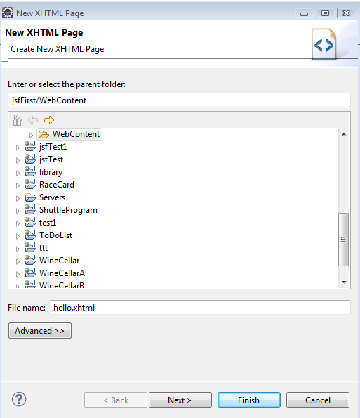
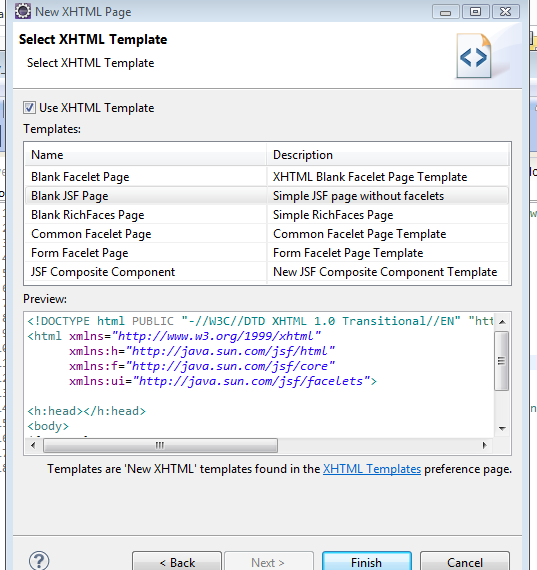
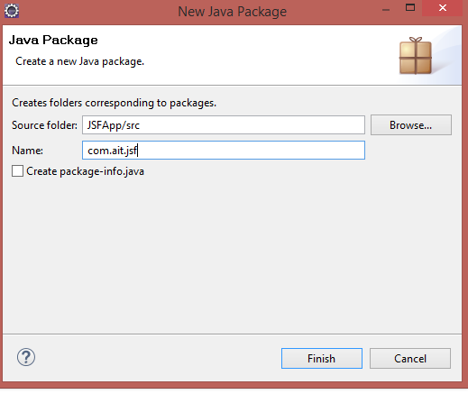
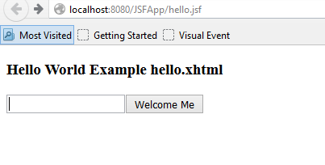
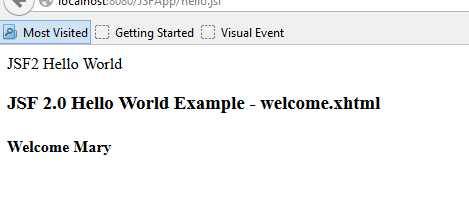

## Creates a file called hello.xhtml that renders a JSF text box, links it to a managed bean to set a property and then display the property in another xhtml file called welcome.xhtml

1.	You can use the same project created in the previous exercise. Add an xhtml file to the WebContent folder.
2.	File-> New -> xhtml page. Select “Blank JSF Pages” as the template.



    Figure 1. New XHTML Page



    Figure 2. Select XHTML Template

3.	Add the following code to hello.xhtml

```xhtml title="hello.xhtml" linenums="1"
<!DOCTYPE html PUBLIC "-//W3C//DTD XHTML 1.0 Transitional//EN" "http://www.w3.org/TR/xhtml1/DTD/xhtml1-transitional.dtd">
<html xmlns="http://www.w3.org/1999/xhtml"
      xmlns:h="http://java.sun.com/jsf/html"
      xmlns:f="http://java.sun.com/jsf/core">

<h:head>
    <title>JSF Hello World Managed Bean</title>
</h:head>
<body>
<h3>Hello World Example hello.xhtml</h3>
    <h:form>
        <h:inputText value="#{helloBean.name}"></h:inputText>
        <h:commandButton value="Welcome Me" action="welcome"></h:commandButton>
    </h:form>
</body>
</html>
```

4.	Create a new package in the src folder.

 

    Figure 3. Java Package

```
▾ 📁 Java Resources
  ▾ 📂 src
    ▾ 📦 com.ait.jsf
      > 📄 HelloBean.java
```

5.	Add a new Java Class to the package with the following code

```java title="HelloBean.java" linenums="1"
package com.ait.jsf;

import java.io.Serializable;

import javax.faces.bean.ManagedBean;
import javax.faces.bean.SessionScoped;

@ManagedBean
@SessionScoped
public class HelloBean implements Serializable {
    private static final long serialVersionUID = 1L;
    private String name;

    public String getName() {
        return name;
    }

    public void setName(String name) {
        this.name = name;
    }
}
```

6.	Add another xhtml page in the WebContent folder called welcome.xhtml with the following content

```xhtml title="welcome.xhtml" linenums="1"
<!DOCTYPE html PUBLIC "-//W3C//DTD XHTML 1.0 Transitional//EN" "http://www.w3.org/TR/xhtml1/DTD/xhtml1-transitional.dtd">
<html xmlns="http://www.w3.org/1999/xhtml"
      xmlns:h="http://java.sun.com/jsf/html"
      xmlns:f="http://java.sun.com/jsf/core">

<h:head>
    <title>JSF2 Hello World</title>
</h:head>
<body>
<h3>JSF 2.0 Hello World Example - welcome.xhtml</h3>
<h4>Welcome #{helloBean.name}</h4>
</body>
</html>
```

7.	Run the project. Navigate to http://localhost:8080/JSFApp/hello.jsf in the browser. You should see the following output.



    Figure 4. hello.jsf

8.	Enter a name and press the button. You will get the following output.



    Figure 5. Welcome Message