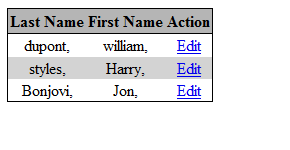
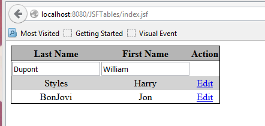
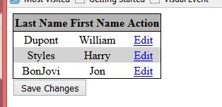
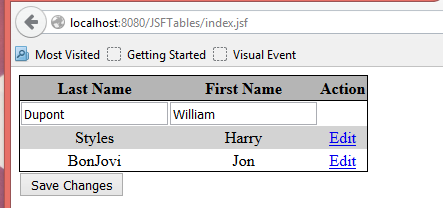
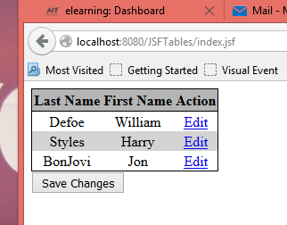

## Example#2 with tables – Editing values in the table

Start with the code from Example#1

1. Add an “editable” property to Name.java with corresponding getter and setter.

```java title="Name" linenums="3"
public class Name {
    private String first;
    private String last;
    boolean canEdit;
}
```

---

```java title="canEdit" linenums="29"
public boolean isCanEdit() {
    return canEdit;
}

public void setCanEdit(boolean canEdit) {
    this.canEdit = canEdit;
}
```

2. Add a method in the TableData.java to allow the property to be set to true. The method takes a Name object as an argument and it calls the setCanEdit method on the Name  object.

```java title="editName()"
public String editName(Name name){
    name.setCanEdit(true);
    return null;
}
```

3. Assign an “Edit” link to the end of each row in the table. If clicked,  the editName method will be called in the TableData object. This in turn will set set “canEdit” = true.
Conditional rendering is introduced here. The “Edit” is only rendered (displayed) when the canEdit property of the name object is set to false.

```xhtml title="xhtml" linenums="3"
<h:dataTable value="#{tableData.names}" var="name"
             styleClass="nameTable"
             headerClass="nameTableHeader"
             rowClasses="nameTableOddRow,nameTableEvenRow">
    <h:column>
        <f:facet name="header">Last Name</f:facet>
        #{name.last},
    </h:column>
    <h:column>
        <f:facet name="header">First Name</f:facet>
        #{name.first},
    </h:column>
    <h:column>
        <f:facet name="header">Action</f:facet>
        <h:commandLink value="Edit" action="#{tableData.editName(name)}"
                       rendered="#{not name.canEdit}" />
    </h:column>
</h:dataTable>
```


 
4. In the JSF page, if “editable”=true, display the input text box for edit. Otherwise display the normal output text.

```xhtml title="xhtml" linenums="3"
<h:form>
    <h:dataTable value="#{tableData.names}" var="name"
                 styleClass="nameTable"
                 headerClass="nameTableHeader"
                 rowClasses="nameTableOddRow,nameTableEvenRow">
        <h:column>
            <f:facet name="header">Last Name</f:facet>
            <h:inputText value="#{name.last}" rendered="#{name.canEdit}"/>
            <h:outputText value="#{name.last}" rendered="#{not name.canEdit}"/>
        </h:column>
        <h:column>
            <f:facet name="header">First Name</f:facet>
            <h:inputText value="#{name.first}" rendered="#{name.canEdit}"/>
            <h:outputText value="#{name.first}" rendered="#{not name.canEdit}"/>
        </h:column>
        <h:column>
            <f:facet name="header">Action</f:facet>
            <h:commandLink value="Edit" action="#{tableData.editName(name)}"
                           rendered="#{not name.canEdit}" />
        </h:column>
    </h:dataTable>
</h:form>
```


 
5. Provide a button below the table to save the changes (after the table and before the closing form tag).  

```xhtml title="xhtml"
        </h:column>
    </h:dataTable>
    <h:commandButton value="Save Changes" action="#{tableData.saveAction}" />
</h:form>
```

A method saveAction must be added to the TableData backing bean. The saveAction method sets the canEdit back to false for all objects in the list.

```java title="saveAction()" linenums="3"
public String saveAction(){
    for (Name name: names){
        name.setCanEdit(false);
    }
    return null;
}
```


 

Click the Edit button


 
 
Edit the values and Press Save


 
