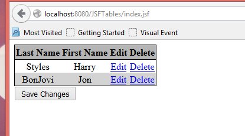

## Example#3 with tables – Delete a row from the table
Start with the code from Example#2

1. Add a Delete column in the xhtml. Change the table heading name from Action to Edit for the third column.

```xhtml
<h:column>
    <f:facet name="header">Edit</f:facet>
    <h:commandLink value="Edit" action="#{tableData.editName(name)}"
                   rendered="#{not name.canEdit}" />
</h:column>
<h:column>
    <f:facet name="header">Delete</f:facet>
    <h:commandLink value="Delete" action="#{tableData.deleteName(name)}"
                   rendered="#{not name.canEdit}" />
</h:column>
</h:dataTable>
<h:commandButton value="Save Changes" action="#{tableData.saveAction}" />
</h:form>
```

2. Add the deleteName method in TableData.java to remove the object from the ArrayList.

```java title="deleteName"
public String deleteName(Name name) {
    names.remove(name);
    return null;
}
```

3. Press the delete button for one of the rows in the table. The row is removed.
 
