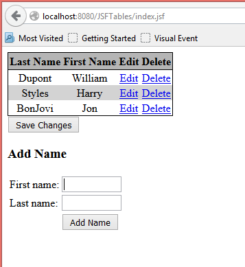
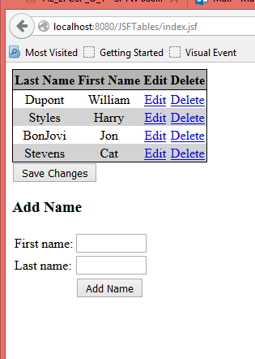

## Example#4 with tables – Adding a row to the table

Start with the code from Example 3

1. Add two input fields below the table but within the form as shown.
 
```xhtml
</h:dataTable>
<h:commandButton value="Save Changes" action="#{tableData.saveAction}" />
<h3>Add Name</h3>
<table>
    <tr>
        <td>First Name :</td>
        <td><h:inputText size="10" value="#{tableData.firstName}" /></td>
    </tr>
    <tr>
        <td>Last Name :</td>
        <td><h:inputText size="10" value="#{tableData.lastName}" /></td>
    </tr>
    <tr>
        <td> </td>
        <td><h:commandButton value="Add Name"
                             action="#{tableData.addName}" /></td>
    </tr>
</table>
</h:form>
```

2. In `TableData.java` add properties and getters and setters for receiving the data that is `firstName` and `lastName`.
 
```java title="TableData.java" linenums="6"
import javax.faces.bean.ManagedBean;
import javax.faces.bean.SessionScoped;

@ManagedBean
@SessionScoped
public class TableData {

    private ArrayList<Name> names;
    private String firstName;
    private String lastName;
```

```java
public String getFirstName() {
    return firstName;
}

public void setFirstName(String firstName) {
    this.firstName = firstName;
}

public String getLastName() {
    return lastName;
}

public void setLastName(String lastName) {
    this.lastName = lastName;
}
```

Add the `addName` method which creates a new Name object and adds it to the names array.

```java
public String addName() {
    final Name name = new Name(this.firstName, this.lastName);
    names.add(name);
    firstName=null;
    lastName=null;
    return null;
}
```



