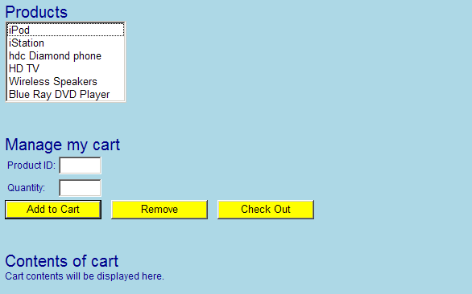
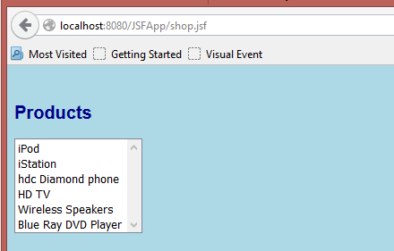
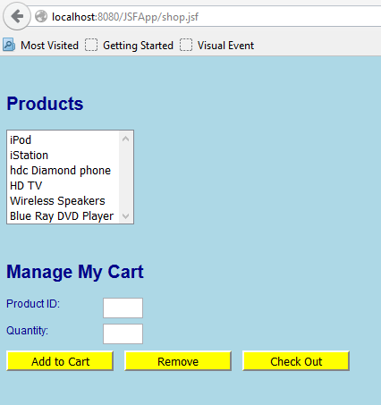
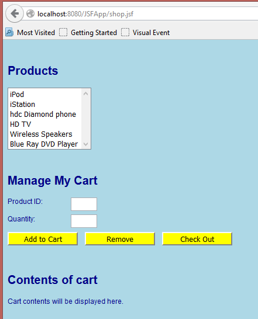

## Using JSF Tags

### Overview

In this lab you will start developing a JSF-enabled Web application. The Web application will simulate a shopping Web site, where users add items to a shopping cart and then proceed to a check-out page. In this lab, you will define the main shopping page as follows (details follow):
 


### Roadmap

There are five exercises in this lab:

1.	[Create a JSF-enabled Web application](#step-1-create-a-jsf-enabled-web-application).
2.	[Add a cascading style sheet (CSS) to the Web application](#step-2-add-a-cascading-style-sheet-css-to-the-web-application).
3.	[Display the "product list" section of the page](#step-3-display-the-product-list-section-of-the-jsp-page).
4.	[Display the "manage my cart" section of the page](#step-4-display-the-manage-my-cart-section-of-the-jsp-page).
5.	[Display the "contents of cart" section of the page](#step-5-display-the-contents-of-cart-section-of-the-jsp-page). 

---

#### Step 1:  Create a JSF-enabled Web application

In Eclipse, create a new dynamic JSF web project as before – adding the necessary .jar files and updating web.xml. Make sure you select the option to generate a web.xml deployment descriptor file. 

Add a file called shop.xhtml in the WebContent folder, add a simple Hello World message in the body.  
Now run the web project, and verify your page appears correctly.

---
 
#### Step 2:  Add a cascading style sheet (CSS) to the Web application

Add a new CSS file in the CSS folder in WebContent folder

```html
<h:head>
<title>Shopping Cart</title>
<h:outputStylesheet name="stylesheet.css" library="css"/>
</h:head>
<h:body>
```
Add the following rules to stylesheet.css

```css
body {
    font-family: Arial,Helvetica,sans-serif;
    font-size: 12px;
    background-color: lightblue;
    color: darkblue;
}
```
 
Place the stylesheet in a folder callled css which is inside a folder called resources in the WebContent.

```
▾ 📁 webcontent
  ▾ 📂 images
  ▾ 📂 META-INF
  ▾ 📂 resources
    > 📂 css
  ▾ 📂 WEB-INF
```

Run the web application again. Verify the page appears in the browser with a light blue body background and a dark blue font. This confirms that the style sheet has been applied successfully.

---

#### Step 3:  Display the "product list" section of the JSP page

You will now start adding JSF tags to define the UI for the Web page… 

Add `<h:form>` element. This is important – if you want to define input controls (such as text boxes and buttons) that submit data to the server, you must enclose them inside an `<h:form>` element.
Inside the `<h:form>` element, add appropriate JSF tags to display the "product list" section of the Web page, as follows:



Hints:

- For the Products heading, use a h2 with class set to  "heading".  

    ```css
    .heading {
        display: block;
        font-size: 20px;
        margin-top: 40px;
    }
    ```
- For the list box, use an `<h:selectOneListbox>`. Set its id to productsListBox.
- For each item in the list box, use an `<f:selectItem>`. Set the itemLabel to the displayable text (such as iPod), and set the itemValue to an integer number (0 for the first item, 1 for the next item, 2 for the next item, etc.).

Run the Web application to make sure the page looks fine before you move on.

---
 
#### Step 4:  Display the "manage my cart" section of the JSP page

In shop.xhtml, add more JSF tags to display the "manage my cart" section of the Web page, as follows:
 


Hints:

- For the Manage my cart heading, use a `<h2>` with class equal to  "heading" 
    - For each label, use an `<h:outputLabel>`. 
    - For each text box, use an `<h:inputText>`. Give the text boxes meaningful id attributes, such as productID and quantity.  Set the Product ID text box to be read-only (readonly=”true”)- users will not be allowed to type a product ID manually – instead, they will select an item in the products list box, and it will automatically set the Product ID text box to the selected product ID; this will be in a later exercise).
    - Apply CSS to the `<label>` and `<input>` to get correct alignment
    ```css
    label {
        width: 8em;
        padding-right: 1em;
        float: left;
    }
    input {
        margin-bottom: .5em;
    }
    ``` 
    - For each button, use an `<h:commandButton>`. Set the id attributes to add, remove, and checkout. Set the styleClass attribute for each button to ActionButton.

    ```css
    .ActionButton {
        width: 120px;
        background-color: yellow;
    }
    ```
 
    Test the Web application before you continue.

---
 
#### Step 5:  Display the "contents of cart" section of the JSP page

Add more JSF tags to display the "contents of cart" section of the Web page, as follows:

 

Hints:

- For the Contents of cart heading, use `<h2>`. Set its class to "heading".
- Display a placeholder message, such as Cart contents will be displayed here, for now.

Test the Web application.