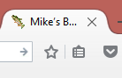
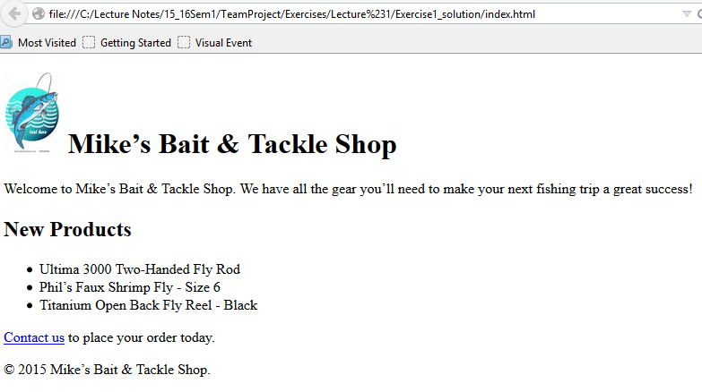
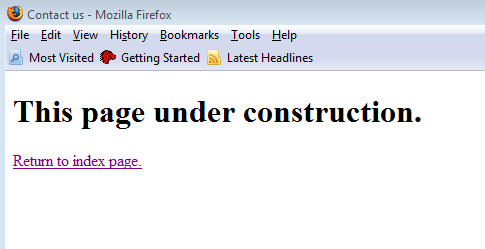

# Exercise 1 Bait Shop

## Files

[Starter Files](https://github.com/joeaoregan/AIT-CSE-TeamProject/tree/master/starter_files)  
[index.html](https://github.com/joeaoregan/AIT-CSE-TeamProject/blob/master/Labs/Lab%201%20Bait%20Shop/index.html)  
[contact.html](https://github.com/joeaoregan/AIT-CSE-TeamProject/blob/master/Labs/Lab%201%20Bait%20Shop/contact.html)

## Exercise #1 Basic html page

### Head Section

1.	Open the template template.html and save it as index.html. Download a copy the images folder.
2.	Enter a title for the page as shown below. Use character entities for the apostrophe and the ampersand in the title. Ref:
<http://www.webstandards.org/learn/reference/charts/entities/markup_entities/>
3.	Add a link element to the head section to link the favicon icon that is in the images folder. Use relative address images/favicon.ico

### Body Section

4.	Define the body section with four div elements. The first div (id=”page”) element came with the template. It will contain everything in the body section and its id is “page”.  Within this div element, code three more div elements with id’s “header”, “main” and “footer”.
5.	Add a h1 element to the header division. Within this h1 element, include the image and the text that will be displayed at the top of the page. To start don’t include a height or width attribute for the img element.
6.	Test the page in a browser and fix any errors.
7.	Set the height of the image to 90 pixels and test again.
8.	Add the first p element to the main division with the text as shown and test again.
9.	Add a h2 element with “New Products” as its text followed by an unordered list.
10.	Add the second paragraph which should include a link that displays a page named contact.html and test again.

### Contact Page

11.	Open the template.html file used in step one and save it as contact.html in the same directory as index.html
12.	Add a title in the head section that displays “Contact us” and a h1 element that displays “this page is under construction”. Lastly add a link that says return to index page.
13.	Test the pages and the links.
14.	Validate the pages and correct any errors.

   	Figure 1. favicon

	Figure 2. Bait Shop

	Figure 3. Under Construction