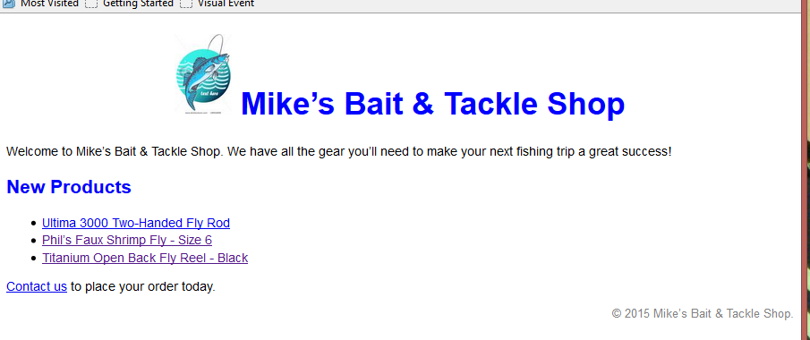

## Exercise 2.1 – CSS

1.	Open the HTML file called `index.html` that you created in Exercise 1. Change the list of products into a list of links.
2.	Create a CSS file called `main.css` and place it in a directory called styles.
3.	In the CSS file, add a rule set for the body element that sets the font-family property so the browser will select the following fonts in sequence: Arial, Helvetica and sans-serif. Also, set the font size to 87.5 percent of the browser’s default size.
4.	In the HTML file add a link element to the head section that includes the main.css file.
5.	Save both files and display in browser to make sure the style sheet is applied.
6.	Add rule sets for the h1 and h2 elements. The text for both elements should be displayed using the color blue. The text for the h1 element should be 200% of the body text, and the text for the h2 element should be 150% of the body text.
7.	Add a rule set for the h1 element that centers it on the page (`text-align:center`) 
8.	Add a rule set for the ul element that set the line height to 1.4 times the size of the font (`line-height:1.4`).
9.	Add a rule set for the paragraph that is assigned to the class named “copyright”. Includes rules that set the color of the paragraph text to gray, set the font size to 90% of the body text, and align the text at the right side of the browser window (`text-align:right`)
10.	Add a rule set for the hover pseudo-class of the a element. this rule set should display a link in boldface when you point it with a mouse. 
    ```css
    a:hover{font-weight:bold;}
    ```    
11.	The page should look like
 
    