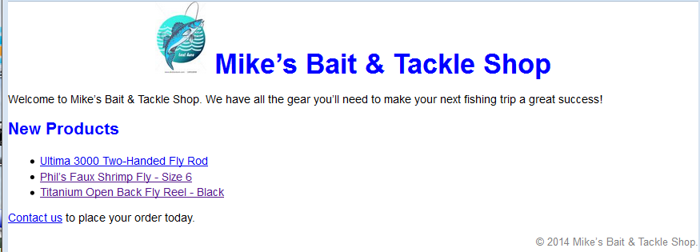
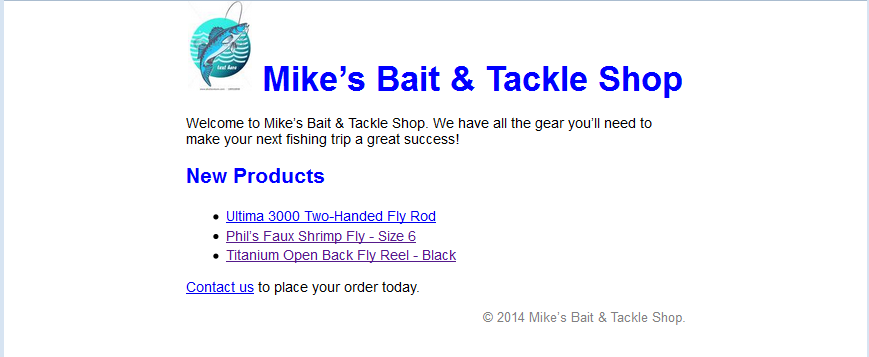
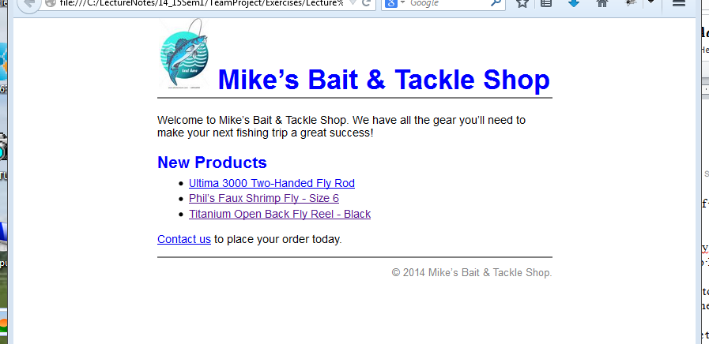
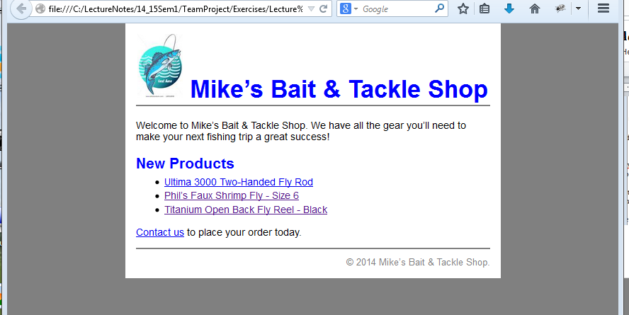

## Files

[Starter Files](https://github.com/joeaoregan/AIT-CSE-TeamProject/tree/master/starter_files/exercise2.2)

## Exercise 2.2 – CSS – Box Model

1.	Start with the files index.html and main.css that you created in Exercise 2.1. The solution is on moodle – (ex2.2_start)
2.	Set the margins of the body element to zero. Save the changes and test the page in the browser. The content of the page should be pushed up to the top and sides. There may be still space at top. To fix it set the margins for the h1 element to 0

    

3.	Add a rule set for the page division (div id=”page”). This rule set should set the width of the page to 500 pixels, the top and bottom margins to zero, and the left and right margins to auto so the page is centered in the browser. Save and test.

    

4.	Set the bottom margin of the h2 element to zero and set the top margin of the ul element to 0.25em. 
borders
5.	Add a rule set for the header division. The rule set should add a solid gray bottom border that’s 2 pixels wide and it should set the bottom margin to 1.4 ems.
6.	Add a rule set for the footer division. This rule set should set the margin top to 0.5 em, add a top border like the one below the header division and set the top padding to 0.7 em.
7.	Set the margins of the copyright class to zero so no space is added above the copyright paragraph.

    

        Adding a background color behind the page  

8.	Set the background color of the body element to gray.
9.	Set the background color of the page division to white.
10.	Add 15 pixels of padding around the page division

    
