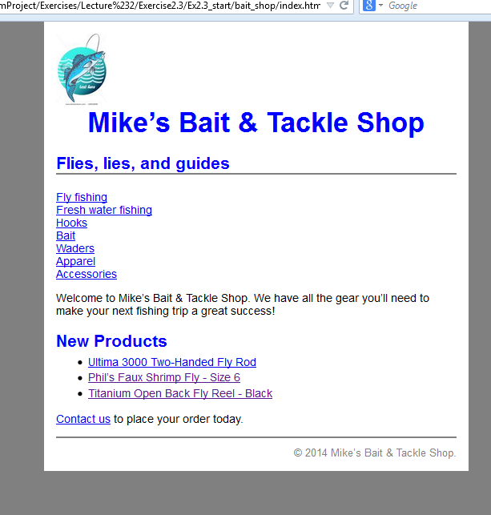
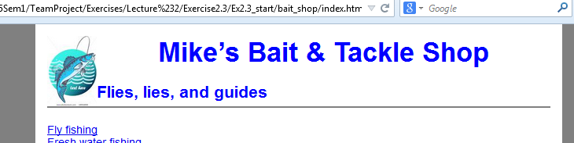
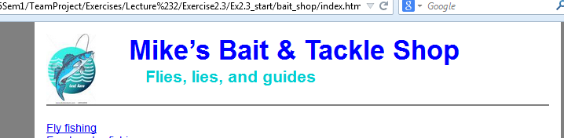
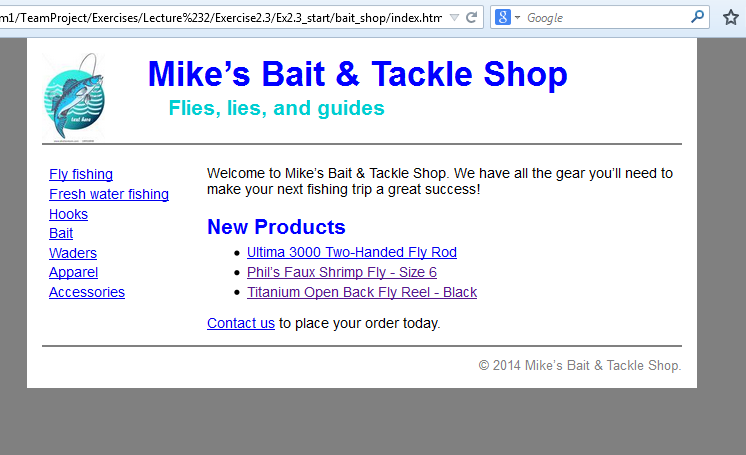

## Exercise 2.3 – CSS – Box Model – Floating elements

1.	Start with the files index.html on moodle and main.css in from Ex2.2
2.	Note the change in the html to add the list. The page should now look like

    Floating the img

3.	Open main.css. Change the width of the page to 640 pixels so it will accommodate a new column.
4.	Add a rule set for the img element in the header division. That means the selector will be coded like this:
#header img{ }
The add rules that float the image to the left.
5.	Add another rule for the header division that sets the height to 90 pixels, the same height as the image. Test the change.

6.	Delete the text-align property for h1 element, and add a rule for the h1 element in the header division that sets the left margin to 3 em. 
7.	Add a rule set for the h2 element in the header division that sets the left margin to 6 em, the other margins to 0 and the color to #00ced1, which is a shade of aqua.

 
    Float the categories division

8.	Add a rule set for the categories division. Give this division a width of 150 pixels and float it to the left. Test the change. 
9.	Add a rule set for the main division that sets the left margin to 165 pixels.
10.	To improve the formatting of the category links, add a rule set for the p element in the categories division that set the line height to 1.4, the top margin to zero, the left and right margins to 0.5em and the bottom margin to 1 em.
11.	Because the main division is longer than the categories division, you do not have to clear the footer division. 

