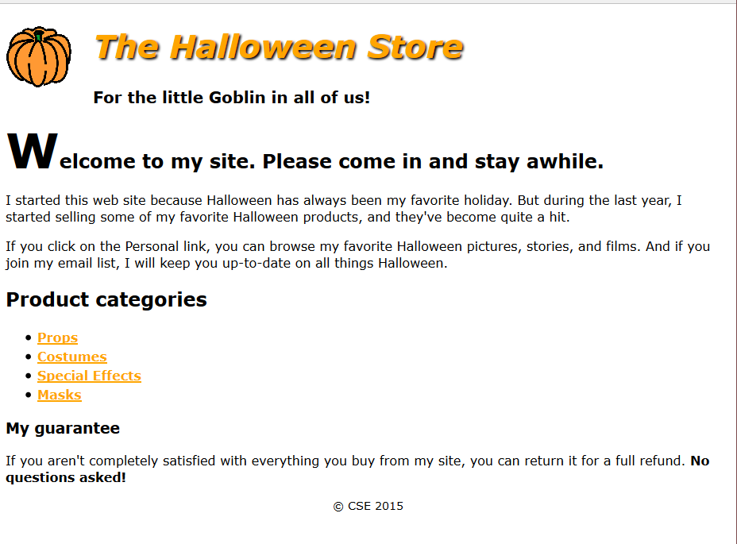

## Files

[Starter Files](https://github.com/joeaoregan/AIT-CSE-TeamProject/tree/master/starter_files/exercise2.4)  
[index.html](https://github.com/joeaoregan/AIT-CSE-TeamProject/blob/master/Labs/Lab%202%20Bait%20Shop/bait_shop/index.html)  
[contact.html](https://github.com/joeaoregan/AIT-CSE-TeamProject/blob/master/Labs/Lab%202%20Bait%20Shop/bait_shop/contact.html)  
[main.css](https://github.com/joeaoregan/AIT-CSE-TeamProject/blob/master/Labs/Lab%202%20Bait%20Shop/bait_shop/styles/main.css)  

## Team Project Exercise 2.4

- Open the HTML file given in the starter files. Create the .css file to format the page as shown.

    

### Instructions

1.	Create the external style sheet for the home page called main.css and put in a folder called “styles”
2.	Set the default font for the document to a sans-serif font. (font-family: Verdana, Arial, Helvetica, sans-serif;)
3.	In the header, float the image to the left. Indent both headings (using text-indent:25px;). In addition, change the color of the first heading to orange (color:orange), italicize it (using font-style), and add a black shadow (text-shadow :2px, 2px, 2px black). Adjust the font-size of the h1 so that it is 250% of the default and the h2 is 125% of the default.
4.	Format the first letter of the first heading in the section so it’s larger than the other letters in the heading. (use selector section h1:first-letter{font-size: 250%})
5.	Format the links so they’re displayed in boldfaced orange whether or not they’ve been visited (font-weight:bold, color:orange). If a link has the focus or the mouse is hovering over it, though, it should be displayed in green ( a:hover, a:focus{color:green;}).
6.	Format the list to increase the space between the list items (line-height:1.5).
7.	Reduce the font size for the footer and center it.(font-size:90%, text-align:center)
